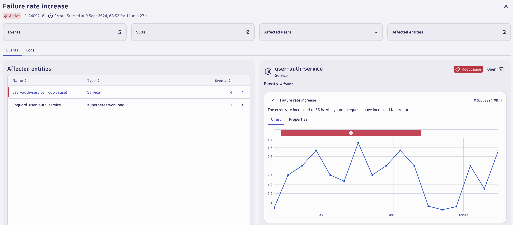

## Lab 1: Getting Started with Logs
 
### The goal of this lab is to:
- Show you how to troubleshoot basic issues
- Use Logs to explore the issue further, eventually checking if it has been solved

### What will participants be able to do after completion of this lab? 
Participants will be first able to navigate within Dynatrace UI, identifying a problem in a simple and easy way. Then they will be able to drill down and understand:  
- the **overall impact** of the problem  
- what’s the exact **root cause**   
- pinpoint the **logs** that are strictly related to that issue.   
- go through further analysis exploring the logs, checking and querying the **logs in the same context of the problem**. It’s important to show how we can analyze logs content, and get value out of logs (**WITHOUT DQL**, and then drill down using *DQL* (within *Notebooks* and/or *Dashboards*))

### Step 1: Finding and viewing a problem
1. Access your **Dynatrace tenant** provided for the lab
2. Open the “**Problems**” app by clicking on it from the sidebar or by using the search function available at the top left.


3. Within the problems app screen you will be able to see a list of **open**/**closed** **problems**
4. For the lab we will select a particular problem of “**Failure rate increase**”. Click on the **problem ID** to open the details of that problem.  



5. Click on **properties** to view additional metadata for the selected entity

### Step 2:  Selecting and analyzing relevant logs related to the problem
There are multiple apps at your disposal for viewing/analyzing logs. For initial analysis we will use the **Logs app**. This app provides an *UI based approach* without the need for DQL or any sort of querying knowledge.

1. Use the **search function** at the top left of the sidebar and search for the “**Logs**” app  


2. With logs app open, set the timeframe to “**last 2 hours**” to match our problem timeframe
3. Click on **Run Query** to view all the logs for the last 2 hours

We can now see *all* the logs that were generated in the last two hours. But we want to narrow it down to investigate our problem and show only relevant logs. 

4. To filter the result, click on **status** and select “**error**”. This will filter logs with errors.
5.	Further, use the content box to filter for all logs related to **login**. You can do this simply by typing “**login**” for the option “**contains**”
6. Now click on **Run Query** for these filters to be applied. *Remember*, the filtering options will not be applied automatically. After every change you have to click “*run query*” for the changes to be applied.

Now we can see all the error logs related to login for the selected timeframe, but from the problem card we already know that the issue is with the **unguard-user-auth-service**. Therefore we can filter it down further and look at the exact logs pertaining to the issue

By default, the logs app shows a few basic filters and most common columns, but you can add a column for any of the available *properties* that you desire and add a filter for it.

7. Click on “**xx columns hidden**” to reveal all available columns. Select "**dt.host.name**" and “**k8s.deployment.name**”. Click on **confirm** to add them to the analysis view
8. Now click on **any log line** to view the log contents and all the metadata for it. In this screen you can use any of the metadata to filter the result. Look for *k8s.deployment.name* and click on the **filter icon** next to it and add it as filter.  


So far, we've been interacting with the UI in a really simple way without the need for extensive querying knowledge. What's behind each of these queries? It is written using *Dynatrace Query Language*, also known as *DQL*. 

We have narrowed down on the problem and filtered the relevant logs, but how can we perform further analysis on this data, or even store or share this data with other members or teams. We can simply do this by exporting this result into another app called "**Notebooks**".

### Step 3: Storing, visualizing and sharing log analysis
1. Click on the “**open with**” button to use this data with another app within Dynatrace. In the subsequent screen select “**Notebooks**”


What we've done so far would basically correspond to a DQL query that we can see here within the *notebook* (analyze it).
 


In this app, we can now see the DQL query that was being automatically generated by the *Logs app* to query this result.

We can then turn the query result into a *chart* with a really simple command that will allow us to **count** *occurrences* **by** *status*. In this way we will be able to show (for the defined timeframe) the *number of log occurrences* fulfilling these conditions, *grouped by status*, showing the overall number of rows with *5 minutes intervals* for example. 
 
2. To achieve this result we need to modify the query a bit. You can simply use **the following query** to achieve this result.

```DQL
fetch logs 
| filter contains(content, "login") 
| filter k8s.deployment.name == "unguard-user-auth-service-*" 
| filter k8s.namespace.name == "unguard" 
| sort timestamp desc 
| makeTimeseries count(), by:{status}, interval: 5m 
``` 
 
We can analyze deeper to create more insightful reports and visualizations. *Notebooks* are a powerful tool. It is out of scope for this lab to explore all the possibilities, but we will take a sneak peak of what is possible. We are going to extract *all* the affected **user(names)** for this login issue. 
 
Now we can extract the different users for status errors, showing who faced the issue 

3. To achieve this we need to *parse* the data and format the result using *DPL*. You can simply use **the below query** and paste it in your notebook.

```DQL
fetch logs 
| filter status == "ERROR" 
| filter contains(content, "login") 
| filter k8s.deployment.name == "unguard-user-auth-service-*" 
| filter k8s.namespace.name == "unguard" 
| parse content, """DATA //  
DATA 'username\":\"' LD:username '\"'""" 
| summarize countDistinct(username), by:{username, status} 
| fieldsRemove `countDistinct(username)` 
```


**You have successfully completed lab 1**.  As discussed we saw how easily and quickly we went from a problem alert to the exact root cause while also gaining business insights. 

