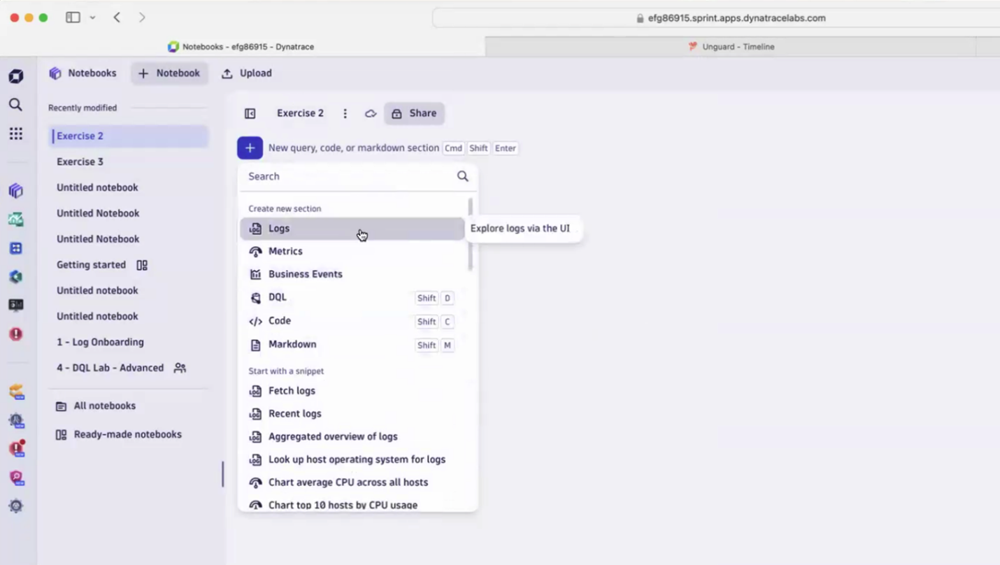
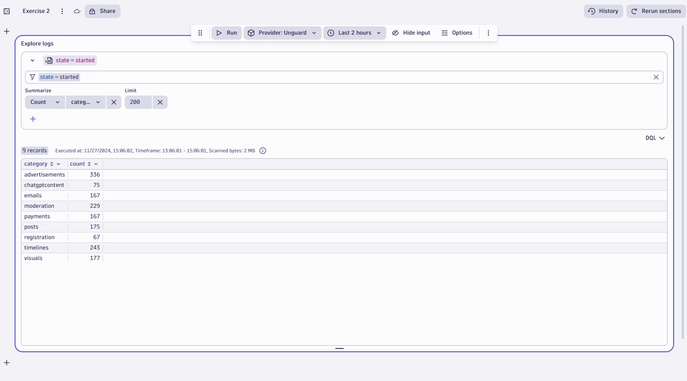
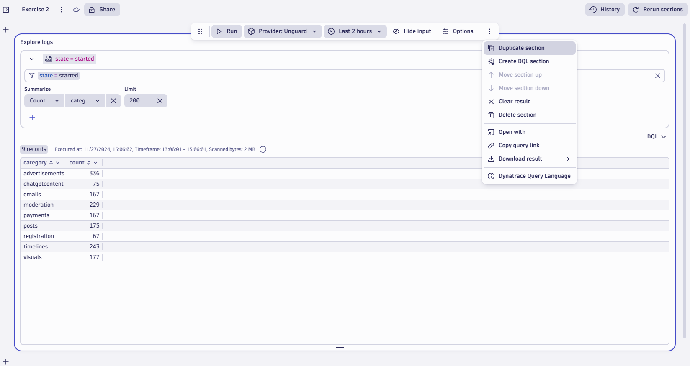
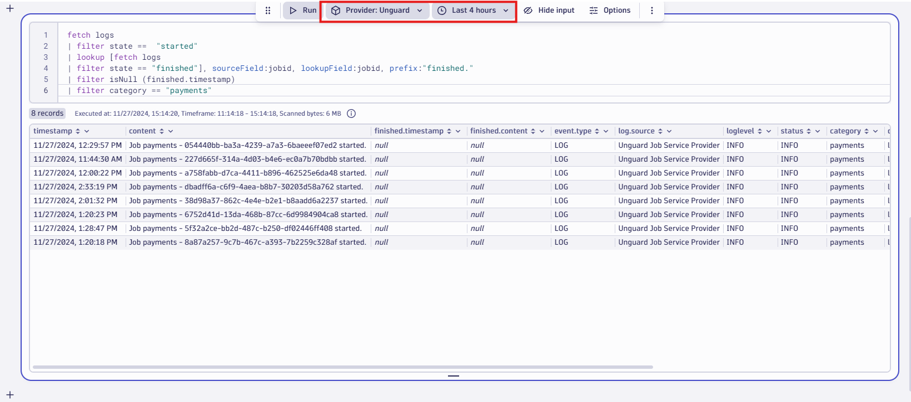
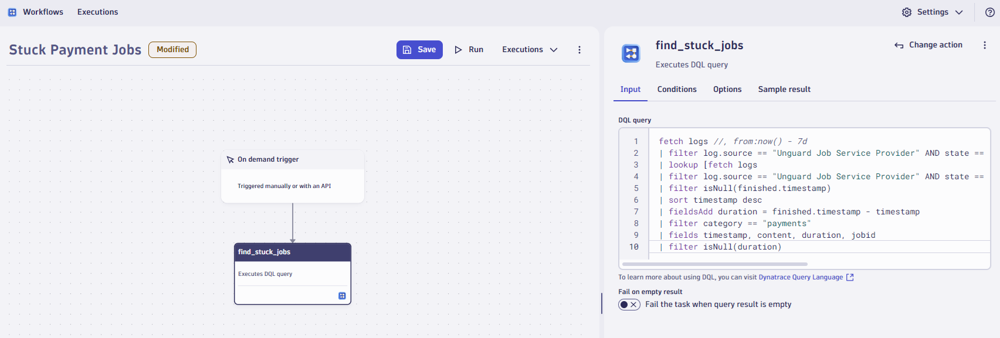

## Lab 2: Bridging Observability Gaps. 
 
### What will this lab focus on? 

In this exercise we are going to work with log data provided by an external supplier. 

### Context/Scenario:

*Unguard* is our social media platform. As a social media platform, there's different things that need to be done to operate it; we need to generate the correct advertisements, we need to do some moderation, we need to pay our content creators, and we've decided to outsource all of this to an external company. 
Since we cannot install oneagent on the 3rd party services, we have agreed with the external company that they will send as all the information via an API and we will monitor that to moderate the jobs.

### Step 1: Populating required data in a Notebook

To view and analyze logs in a Notebook, we need to create a new *notebook* for logs.

1. Since we learnt how to open a new Notebook in the previous lab, open another Notebook for this exercise. Click on the **Notebooks app** on the sidebar or use the search function
2. Once you open a Notebook create a new section for logs by clicking on the blue “**+**” icon and selecting Logs from the drop down menu.  



Now we have a new section with log data. But we want to look at the specific logs for the unguard service. For this we need to filter down the log data.

3. Click on the top filter bar in the section and select **log.source** and use the following value for the filter

```log.source = "Unguard Job Service Provider"```


 
4. Once we have the filter, let's increase the number of log lines retrieved by increasing the limit. Click on the “**Limit**” box and increase the number from 20 to **200**

We can add additional filters for *jobid* or other parameters by simply clicking on those fields and adding it to the filter as we saw in the last lab

5. Next, we want to view how many jobs were started and finished in the last 2 hours. To do this simply click on the “**state**” column and click on **summarize**.  


Now we see the total number of jobs that were started and finished the past 2 hours

To remove this summary, simply click on the ‘**X**’ button next to the summarize option. You can always remove any filter or modification you add to the analysis by clicking the ‘**X**’ button next to it from the UI without modifying DQL 


Next, we will want to view how many jobs were started in different categories. To achieve this we need to first filter the data for jobs that were started and then summarize it for all the categories

6. Click on any field with the value of “**started**” under the “**state**” column and click on "**Filter**".  


This will add a filter bar at the top, but you can see that the logical condition by default is “**OR**”. We need to change this as we want only the jobs that were started. Simply edit this by clicking on it, and replace it with “**AND**” by typing it in.

7. Now that the filters are added click on the “**category**” column and **summarize** as we did in the previous steps. This should give us a summarized result of all jobs that were started in each category for the past two hours.  



Now let's follow the same process and create a view for all jobs that were finished. This time let's create a new section instead of changing the filters for the current one. In *notebooks* we can have multiple analysis that can be saved as sections.

8. Instead of creating a new section from scratch, we can also duplicate a section for ease of use. Simply click on the **elipses (3 dots)** at the end of the top menu and select the “**duplicate section**” option. 



9. Now follow the steps you have learnt to **filter** and **summarize** for *all finished jobs* in each category.

This is good data, but wouldn’t it be more useful to understand if all the jobs that were started had successfully finished or if there some issues? We can analyze this and find jobs that were started but not completed, that is they were stuck.
For this step, we would need to write a couple of DQL queries. To do this open a new section in the notebook and select “**DQL**” this time instead of logs.

10.	In the new section simply copy and paste **the below DQL query**

```DQL
fetch logs  
| filter log.source == "Unguard Job Service Provider" AND state ==  "started" 
| lookup [fetch logs 
| filter log.source == "Unguard Job Service Provider" AND state == "finished"], sourceField:jobid, lookupField:jobid, prefix:"finished." 
| filter isNull (finished.timestamp)
```
 


Once you run this query, you should be able to see all the jobs that were started but never finished. These are all the jobs that are stuck. 

What did we exactly do? 

We simply used the “*lookup*” function to create a sub query connecting started and finished jobs with source field “*jobid*” from the first table and lookup field from the second table that would be the same, and then adding a prefix: "*finished*". 

Once we retrieved this subset we filter it to look for all the log entries with “*null*” value for the finished timestamp.

### Step 2: Creating insightful dashboards

Now that we have filtered and analyzed the log data, let's see how we can create dashboards for important data points.

For this example, let's look at all the jobs for the payment category as it is important for the business. 

1. Simply click on any “**payments**” field in the “**category**” column and click **filter**. This will filter the data for stuck jobs in the payment category. If you do not see any log data in the lab, try increasing the timeframe to last **4 hours** instead of 2 



2. Let's place this data on the dashboard. To achieve this click on the **elipses (3 dots)** in the top menu and select the “**open with**” option. In the following pop-up select **Dashboard** 


3. Now you will be able to see the new tile in your dashboard with the same log data that we had in the notebook.  


This is not very useful or readable in a dashboard format. It would be better if we could simply see the number of jobs that are stuck for the *payment* category. We can achieve this by *summarizing* or *counting* the entries. We can do this by modifying query in the notebook and placing it on the dashboard again or simply editing the query in the dashboard itself.

For this example let us go back to the notebook.

4. Simply add the **summarize** command to the existing query to get the count for the stuck jobs  


Here is the full query if you want to copy and paste.

```DQL
fetch logs  
| filter log.source == "Unguard Job Service Provider" AND state ==  "started" 
| lookup [fetch logs 
| filter log.source == "Unguard Job Service Provider" AND state == "finished"], sourceField:jobid, lookupField:jobid, prefix:"finished." 
| filter isNull (finished.timestamp)
| filter category == "payments"
| summarize count()
```

We can beautify it and make it more readable by changing visualizations and add threshold color coding.

5. Click on the “**options**” button in the top menu and this will open the *visualization options* menu on the right side of the section.  


6. In the visualization panel perform the following configuration
    - Select “**Single Value**” as visualization
    - In data mapping section select “**count()**” as Value
    - In single value options enable “**show label**” and name it “**Stuck Jobs**” 


7. We can also set a threshold by clicking on the “**threshold**” tile in the same panel at the bottom. You can play around with the values and test the color coding.


Now we have a much more readable and insightful tile that can be placed on the Dashboard. Follow the steps you learnt previously, and place this data on the dashboard by selecting the “**open with**” option.

### Step 3:  Creating an alert for our datapoint
To create alerts we need to use the “*Workflows*” app.

1. As we have already learned how to open any app, use the search function to find and open “**Workflows**”
2. Once you open the app create a new workflow by clicking the “**+**” button


3. We need to first create a trigger that will invoke the workflow. For this example we will use the **fixed/On-demand trigger**.
4. Once we create a trigger we have to add tasks to it. Click on the “**+**” icon the trigger to add a task to it.  


5. In the following panel, select “**Execute DQL Query**” as the action
6. In the input section simply paste the below query. It is essentially the query we used in our notebook

```DQL
fetch logs //, from:now() - 7d
| filter log.source == "Unguard Job Service Provider" AND state == "started"
| lookup [fetch logs
| filter log.source == "Unguard Job Service Provider" AND state == "finished"], sourceField:jobid, lookupField:jobid, prefix:"finished."
| filter isNull(finished.timestamp)
| sort timestamp desc
| fieldsAdd duration = finished.timestamp - timestamp
| filter category == "payments"
| fields timestamp, content, duration, jobid
| filter isNull(duration)
```



7. Now add the next task and select “**list issues**” under *Gitlab for Workflows*. Simply select “**logs-in-context**” project from the drop down menu for the “*Input Gitlab details*” section


8. We need to add an option to check existing issues that are already open for the corresponding stuck job. We can achieve this by creating a loop task in the Options tab. **Use the below configs**;

```
Item variable name: item
List: find_stuck_jobs.records
Concurrency: 5
```


Next we need to create a *JS task* that will compare the issues list against the stuck jobs and retrieve all the stuck jobs that do not have an issue created in gitlab.

9.	Add a new task and select “**Run Javascript**” and **paste the below code** in the Input field

```JavaScript
import {execution} from '@dynatrace-sdk/automation-utils';
export default async function ({ execution_id}) {
  const exe = await execution(execution_id);
  const result = await exe.result("find_stuck_jobs");
  const result1 = await exe.result("list_issues_1");

  var resultJobIDs = [];
  
      for (const j in result1) {
          if (result1[j].issues.length == 0) {
            resultJobIDs.push(result.records[j].jobid)
          }
      }
  return resultJobIDs;
}
```


For the final step we will create a new task that will create a new issue in gitlab for the stuck jobs.

10.	Add a new task and select “**Create New Issue**” from the *Gitlab for Workflows* section. In the input section **use the following values**;


```
Project: logs-in-context
Title: Payment Transaction Stuck for jobid: {{_item}}
Description: The payment needs to be investigated and fixed
```

11.	Save the workflow using the “**save**” button at the top of the workflow.

Now we have created our alert and all set. Try running the workflow and inspect the results.