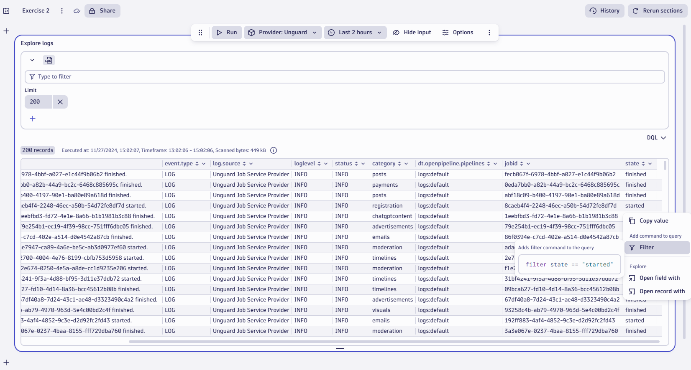
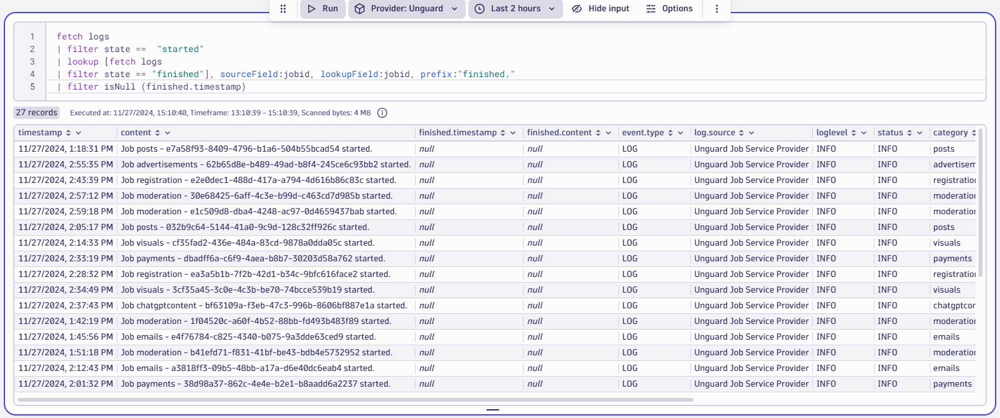
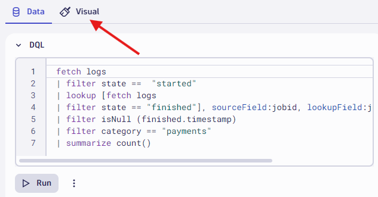
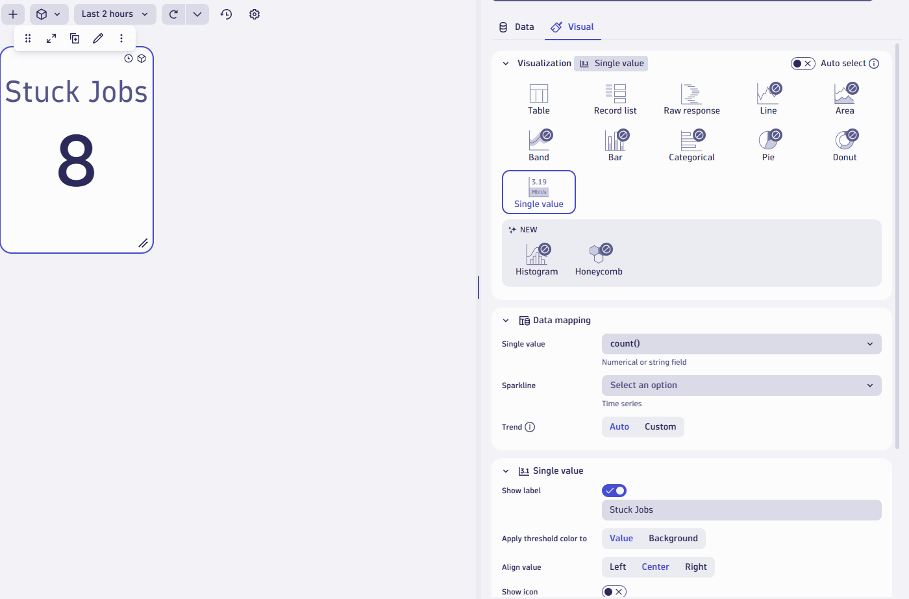
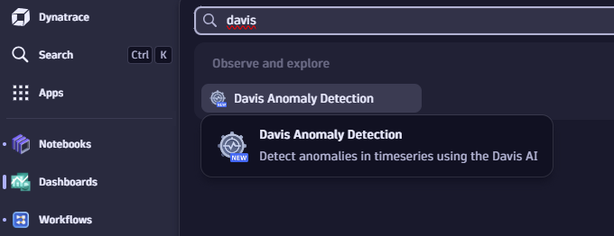

## Lab 2: Bridging Observability Gaps
 
### What will this lab focus on? 

In this exercise we are going to work with log data provided by an external supplier. 

### Context/Scenario:

*Unguard* is our social media platform. As a social media platform, there's different things that need to be done to operate it; we need to generate the correct advertisements, we need to do some moderation, we need to pay our content creators, and we've decided to outsource all of this to an external company. 
Since we cannot install oneagent on the 3rd party services, we have agreed with the external company that they will send as all the information via an API and we will monitor that to moderate the jobs.

### Step 1: Populating required data in a Notebook

To view and analyze logs in a Notebook, we need to create a new *notebook* for logs.

1. Since we learnt how to open a new Notebook in the previous lab, open another Notebook for this exercise. Click on the **Notebooks app** on the sidebar or use the search function
2. Once you open a Notebook create a new section for logs by clicking on the blue “**+**” icon and selecting Logs from the drop down menu.  


Now we have a new section with log data. But we want to look at the specific logs for the unguard service. Segments are used for initial filtering for the logs we are interested in. 

3. Click on the segment icon and select `+ Segment` then choose `Provider` and `Unguard` as the value. Click `Apply` and run the query. This segment will automatically apply a filter to our query for log.source contains "Unguard".

```log.source = "Unguard Job Service Provider"```


 
4. Once we have the filter, let's increase the number of log lines retrieved by increasing the limit. Click on the “**Limit**” box and increase the number from 20 to **200**. Click `Run` to refresh the results.

We can add additional filters for *jobid* or other parameters by simply clicking on those fields and adding it to the filter as we saw in the last lab

5. Next, we want to view how many jobs were started and finished in the last 2 hours. To do this simply click on the “**state**” column and click on **Summarize**.  


Now we see the total number of jobs that were started and finished in the past 2 hours

To remove this summary, simply click on the ‘**X**’ button next to the summarize option. You can always remove any filter or modification you add to the analysis by clicking the ‘**X**’ button next to it from the UI without modifying DQL 


Next, we will want to view how many jobs were started in different categories. To achieve this we need to first filter the data for jobs that were started and then summarize it for all the categories

6. Click on any field with the value of “**started**” under the “**state**” column and click on "**Filter**".  



7. Now that the filters are added click on the “**category**” column and **summarize** as we did in the previous steps. This should give us a summarized result of all jobs that were started in each category for the past two hours.  


Now let's follow the same process and create a view for all jobs that were finished. This time let's create a new section instead of changing the filters for the current one. In *notebooks* we can have multiple analysis that can be saved as sections.

8. Instead of creating a new section from scratch, we can also duplicate a section for ease of use. Simply click on the **elipses (3 dots)** at the end of the top menu and select the “**duplicate section**” option. 


9. Now follow the steps you have learnt to **filter** and **Summarize** for *all finished jobs* in each category.

This is good data, but wouldn’t it be more useful to understand if all the jobs that were started had successfully finished or if there some issues? We can analyze this and find jobs that were started but not completed, that is they were stuck.
For this step, we would need to write a couple of DQL queries. To do this open a new section in the notebook and select “**DQL**” this time instead of logs. The Unguard segment selection should remain active on the new DQL section, ensure that the `Provider: Unguard` segment is active.

10.	In the new section simply copy and paste **the below DQL query**

```DQL
fetch logs  
| filter state ==  "started" 
| lookup [fetch logs | filter state == "finished"], sourceField:jobid, lookupField:jobid, prefix:"finished." 
| filter isNull (finished.timestamp)
```
 


Once you run this query, you should be able to see all the jobs that were started but never finished. These are all the jobs that are stuck. 

What did we exactly do? 

We simply used the “*lookup*” function to create a sub query connecting started and finished jobs with source field “*jobid*” from the first table and lookup field from the second table that would be the same, and then adding a prefix: "*finished*". 

Once we retrieved this subset we filter it to look for all the log entries with “*null*” value for the finished timestamp.

### Step 2: Creating insightful dashboards

Now that we have filtered and analyzed the log data, let's see how we can create dashboards for important data points.

For this example, let's look at all the jobs for the payment category as it is important for the business. 

1. Simply click on any “**payments**” field in the “**category**” column and click **filter**. This will filter the data for stuck jobs in the payment category. If you do not see any log data in the lab, try increasing the timeframe to last **4 hours** instead of 2 


2. Let's place this data on the dashboard. To achieve this click on the **elipses (3 dots)** in the top menu and select the “**open with**” option. In the following pop-up select **Dashboard** 


3. Now you will be able to see the new tile in your dashboard with the same log data that we had in the notebook.  


This is not very useful or readable in a dashboard format. It would be better if we could simply see the number of jobs that are stuck for the *payment* category. We can achieve this by *summarizing* or *counting* the entries. We can do this by modifying query in the notebook and placing it on the dashboard again or simply editing the query in the dashboard itself.

For this example let us edit our tile by clicking on the pencil icon.


4. You'll notice our tile specific segment and timeframe are maintained from the notebook section. Simply add the **summarize** command to the existing query to get the count for the stuck jobs  


Here is the full query if you want to copy and paste.

```DQL
fetch logs  
| filter state ==  "started" 
| lookup [fetch logs 
| filter state == "finished"], sourceField:jobid, lookupField:jobid, prefix:"finished." 
| filter isNull (finished.timestamp)
| filter category == "payments"
| summarize count()
```

We can beautify it and make it more readable by changing visualizations and add threshold color coding.

5. Click on the “**Visualize**” button in the top menu and this will open the *visualization options* menu on the right side of the section.  



6. In the visualization panel perform the following configuration
    - Select “**Single Value**” as visualization
    - In data mapping section select “**count()**” as Value
    - In single value options enable “**show label**” and name it “**Stuck Jobs**” 



7. Create a threshold for the single value. Click on the **threshold** option at the bottom. Set the value to at least one number lower than the current number of stuck jobs to get a color change.


### Step 3:  Creating a problem event for our datapoint
To create a problem event we will use the Davis Anomaly Detector App. Notifications of problem events can be accomplished through existing alerting profiles and problem notification configurations OR simple workflows. For this exercise we'll combine the Davis Anomaly Detector Event with a simple workflow to send an email. 

When using the Davis Anomaly Detector App for the first time we have a one time prerequisit to enable user permissions on the App. Please follow the following steps to enable the permissions:

1. Open the Apps panel from the left hand navigation menu and select **Davis Anomaly Detection.**



2. In the top right corner of the app select **Settings** and **Authorization Settings.** Then click the **Select All** button and save the changes.


3. Return to your dashboard by opening the Dashboards App.


Davis Anomaly Detectors can be developed and visualized directly within dashboards & notebooks. Then we'll open our query directly into the Davis Anomaly Detection App. 

1. First we must modify the query to create a timeseries of stuck jobs. Select the tile and choose the Duplicate option. 

2. Modify the DQL query by changing the `summarize` command to `makeTimeseries`. We'll assign the timeseries to a field labled **Stuck Jobs**

You can copy and paste the complete DQL below:

```DQL
fetch logs  
| filter state ==  "started" 
| lookup [fetch logs 
| filter state == "finished"], sourceField:jobid, lookupField:jobid, prefix:"finished." 
| filter isNull (finished.timestamp)
| filter category == "payments"
| makeTimeseries Stuck_Jobs = count(default:0), interval:1m
```

3. Run the query and then select **Visual** and select **Line**


Now that we've converted the sum of jobs into a trending timeseries we can simulate a Davis Anomaly Detector.

4. With the tile still in the edit mode select the **Data** tab and then select **Davis AI**


5. Click the toggle to enable **Davis AI**
6. For the analyzer select **Static threshold anomaly detection**
7. Click the toggle to enable **Show Advanced Properties**
8. Input the following values: `Threshold: 0`, `Alert Condition: Alert if metric is above`, `Violating Samples: 1`, `Sliding Window: 5`, `Dealerting Samples: 5` and click **Run**


This configuration will alert if we have 1 or more stuck jobs within a 5 minute sliding evaluation period. The results show that we have 1 problem identified when the second stuck job occured. The problem event will remain open until there 5 minutes with no violations in the 5 minute sliding window.


9.	Use the **elipses (3 dots)** in the top menu and select the **Open With** option. Choose Davis Anomaly Detection.

10.	Input a title for the new Anomaly Detector: `Unguard Stuck Jobs`

The configuration of the anomaly detector we created on the dashboard is persisted so we do not need to modify the query or parameters to the anomaly detector.


11. Click **Create an Event Template**

12.	For the event name input the following:

```
Unguard Stuck Jobs
```

13. For the event description input the following:

```
Unguard has at least {violating_samples} Stuck Jobs in the last 5 minutes
```


14. Click **Create**

15. After a few minutes, refresh the screen and you should see the status of the new anomaly detector is **Success.**

### Step 4: Create a workflow to notify on Unguard Stuck Jobs

Workflows are a very flexible way to automate any kind of task in dynatrace. For this lab we will use a simple workflow to generate an email when Unguard has triggered our stuck jobs Anomaly Detector. Since this is our first time running workflows, we'll have to enable user permissions to execute them before we can create our notification.

1. Using the left hand navigation, open the **Workflows App**
2. In the top right corner of the workflows app, select the **Settings** drop down and choose **Authorization Settings.**


3. Enable all permissions and click **Save.**


4. To exit the workflow app settings, click the workflows button in the top left corner. Then click **+ Workflow** to create a new workflow.
5. Give the workflow a name called `Unguard Stuck Jobs` and for the first trigger select **Davis Problem Trigger.**
6. Set event state = `Active`, event category = `Custom`, Affected Entities = `include all entities`, expand Additional custom filter query and paste the following filter: `event.name == "Unguard Stuck Jobs"`


7. Add a new task to our workflow by selecting the **+** icon from the problem trigger. Search for `email` and select the **Send Email** task type.


8. Change the name of the task to `send_email`. Then configure the email task by populating the following inputs: **To:**, **Subject:**, and **Message:** inputs. 

For the message input you can copy:

```
The Unguard payments job is stuck.

View the dynatrace problem here: {{ environment().url }}/ui/apps/dynatrace.davis.problems/problem/{{ event()["event.id"]}}

```


*Note*: If you'd rather not use a live email address, you may input anything here with a valid format. You can also explore other task options to understand more scenarios that are possible other than email. 

Now we have created our alert and all set. Save and try running the workflow and inspect the results.