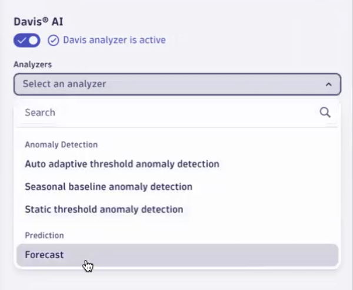
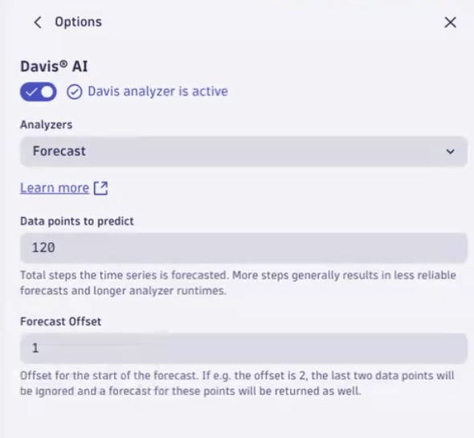
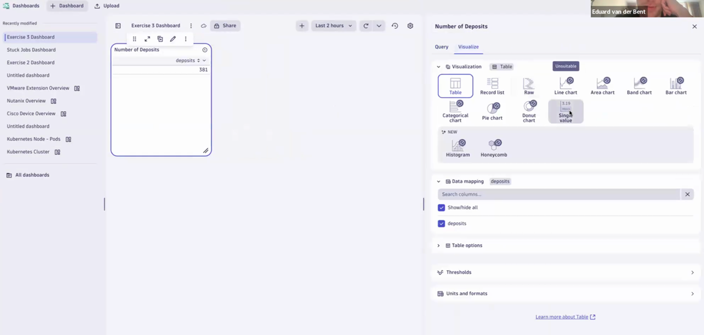

## Lab 3: Business Use Case

### Lab Materials
In this lab we will work primarily out of a Notebook provided in the course materials tab in Dynatrace University. You should see 2 files, one is the working notbook and the other is an answer key. Feel free to keep the answer key open as a reference during this lab.
 
### What will this lab focus on?
In this lab we’ll use the App “*Easytrade*”, which is a trading platform App where people can buy, sell, transfer and withdraw funds. We will demonstrate for you how *Easytrade* works and the importance of observing the App to see how much money is being traded (stock market never closes here). We’ll also show you how to find logs via *Notebooks* of trades and complete an exercise in data analysis to build a business dashboard.  
 
### Lab Objective
Learn how *log data*, *notebooks*, and *dashboards* in Dynatrace can answer important business performance questions.  
 
### Lab Scenario 
Our business App, *EasyTrade* has log data that we need to analyze to determine if our business is making money, or not. Our App executives have asked you to answer the following questions:  
  
1. How many **deposits** were made in the last two hours?  
2. How many **withdrawals** were made in the last two hours?  
3. How much money is the platform **earning**?  
4. Which account had the **biggest increase/decrease**? 
5. Can we **predict the future earnings** of the platform?  
6. What are the **top 5 accounts** with the most money going out?  
7. How much money is traded **long compared to market trades**?  
8. How much money is **deposited vs withdrawn**? 
 
We’ll go through all the necessary steps to pull actionable log data together, in a Dynatrace *notebook*, and how to go about analyzing the data so that you can answer each question above. Once we’ve answered each question, summarized into one notebook and then dashboard - you’ll be able to confidently answer all your leaderships business questions, accurately, and visually! 


### Why is knowing/doing this important? 
Ultimately, we want to use this data, not solely just for observability purposes, but to specifically report on how our business is doing. Excercises in this lab will demonstrate how we can turn actionable data in to answers for critical performance questions like, "*Can we predict the future earnings of the platform?*", "*How much money is the platform earning?*", and, ultimately, "*is my business profitable?*"  

### Step 0: Selecting and filtering required log data
1. The starting query has been populated for you in the Notebook! Refer to that query when needed!

### Question 1: How many deposits were made in the last 2 hours?
Let's answer the first question: **How many deposits were made in the last two hours?**

To achieve this we need to filter the data for the deposit action and count the number of entries for the last two hours

1. Click on any “**deposit**” field in the “**actionType**” column and click on **filter**. This will filter the data for all deposits.


2. Next click on the column “**actionType**” and click on “**summarize**”. This will generate the number of deposits for the selected timeframe.


With that, we have answered the first question, and know how many deposits were made in the last 2 hours.

### Question 2: How many withdrawals were made in the last two hours?
Let's move to the next question: **How many withdrawals were made in the last two hours?**

1.	Let's proceed by duplicating **the current section** where we have the data for deposits.  


2. In the duplicated section, simply replace the **actionType** in the filter with the value of “**withdraw**”. The rest of the query stays the same. Click **Run** and you should have the same data for withdrawals. Below is the final query:

```
fetch logs
| filter contains(content, "balance")
| fields timestamp, content, accountId, actionType, oldValue, valueChange, balance
| filter actionType == "withdraw"
| summarize count = count(), by:{actionType}
```


### Question 3: How much money is our platform earning?

We know that the business makes money through the transaction fee and the *actionType* related to it is “**collectfee**”. Therefore we need to filter and summarize data related to this action.

1. To start with this, you can again duplicate **the previous section**. There two changes required for this query.
2. First, we need to change the filter value for **actionType** to “**collectfee**”.
3. Next, summarize the total of the **valueChange** instead of counting it.

Below is the final query;

```
fetch logs
| filter contains(content, "balance")
| fields timestamp, content, accountId, actionType, oldValue, valueChange, balance
| filter actionType == "collectfee"
| summarize TransactionFeesCollected = sum(valueChange)
```


 
Now we know that the business is making profit and how much money was earned in the last 2 hours

### Question 4: Which accounts had the biggest increase / decrease?

To achieve this, we will track the *valueChange* corresponding to the *accountId* and order the resulting data in descending order.

1. To start with this, you can again duplicate **the previous section** and remove the last 2 lines.
2. For this query we will first add an additional field “**absoluteValueChange**” to track the absolute change in value as we want to know biggest change regardless of **increase/decrease**.
3. We then would like the sort by the **absoluteValueChange** in descending order to get the accounts with the biggest change.
4. We also want to make it easier to view by futher reducing the fields to just **accountId** and **absoluteValueChange**.
5. Lastly, let's limit it to just the top 10 accounts with the biggest.
  
You can copy and paste the below DQL query and hit “**Run**”.

```
fetch logs
| filter contains(content, "balance")
| fields timestamp, content, accountId, actionType, balance, oldValue, valueChange
| fieldsAdd absoluteValueChange = abs(valueChange)
| sort absoluteValueChange desc
| fields accountId, absoluteValueChange
| limit 10
```


Now we can the list of accounts that had the biggest change in their balance.

### Question 5: Can we predict future earnings of our platform?

To achieve this, we need to create a *timeseries* of our *current earnings* and use this data to *forecast* future earnings.

1. Start by duplicating **the third section** where we filtered on **collectfee**.
2. Since we need a timeseries can use the *makeTimeseries* command instead of *summarize*. To do this, we can remove the summarize line then click on the **“oldValue**” column, click on **convert to timeseries**, and choose the **avg** aggregation.
   
```
fetch logs
| filter contains(content, "balance")
| fields timestamp, content, accountId, actionType, oldValue, valueChange, balance
| filter actionType == "collectfee"
| makeTimeseries avg(oldValue), time:{timestamp}
```


We have the required result but in the wrong visualization format. We would like to see a graph instead of listing all of the data points.

3. To achieve this, click on **options** to select **visualizations** as we had seen previously. In the visualization panel select “**Line chart**”  


4.	Now that we have a timeseries, we can ask *Davis AI* to create a *forecast*. To achieve this, click on “**Options**” again and in the visualization panel scroll to the bottom of the list to find **Davis AI**, click it.  


5.	Click the **check mark** to activate the analyzer, and select “**forecast**” to predict. Forecast will predict the future based on the original data set.  Hit **Run** to chart.  


 
Change the time frame from 100 to “**120**” to reflect the same time period of two hours. You can increase your time prediction to max 600 min.  



Now we have a forecast of our earnings and can see the forecast of our earnings for the next 2 hours.

### Question 6: What are the top 5 accounts with the most money going out?

To achieve this we need to track *withdrawals* by account and calculate the sum of *valueChange*

1.	Duplicate the very **second section**  with ***withdraw** to get started, and hit “**Run**”.
```
fetch logs
| filter contains(content, "balance")
| fields timestamp, content, accountId, actionType, oldValue, valueChange, balance
| filter actionType == "withdraw"
| summarize count = count(), by:{actionType}
```
2.	We now need to summarize on the value change. Replace the summarize command with **sum(valueChange)** splitting by **accountId**.
3.	Sort it in an **ascending** order so accounts with the biggest sum of withdrawls are at the top.
4.	Limit the list to the top 5 accounts. You can use **the below query** to achieve the result:

```
fetch logs
| filter contains(content, "balance")
| fields timestamp, content, accountId, actionType, oldValue, valueChange, balance
| filter actionType == "withdraw"
| summarize sum(valueChange), by:{accountId}
| sort `sum(valueChange)` asc
| limit 5
 ```

Now we can see the top five accounts who have the most money going out in the last 2 hours.


### Question 7: How much money is traded long compared to market trades?

To answer this question, we’re going to look at actionTypes, “sell” or “buy” transactions. 
 
1.	Create a new section with the query created in **Step 0** and hit “**Run**”.
```
fetch logs
| filter contains(content, "balance")
| fields timestamp, content, accountId, actionType, oldValue, valueChange, balance
```

2.	Now we need to edit the query adding an additonal filter by the logs what have buy or sell in the content
```
| filter contains(content, "sell") or contains(content, "buy")
```

Hit **Run** to reveal the results. 


Now we can see all transactions related to *buying* and *selling*, but we want to filter for a particular transaction types. 

3. To achieve this simply summarize your data by **value** change count and by “**actionType**”

Below is the final query

```DQL
fetch logs
| filter contains(content, "balance")
| filter contains(content, "sell") or contains(content, "buy")
| fields timestamp, content, accountId, actionType, oldValue, valueChange, balance
| summarize sum(valueChange), by:{actionType}
```
 


4.	To improve visualisation simply go to options and change the visualization to a **pie chart**. Use the “**color**” feature to separate sells from buys (all types):  


### Question 8: How much money is deposited vs withdrawn?

1.	Create a new section with the query created in **Step 0** and hit “**Run**”.
```
fetch logs
| filter contains(content, "balance")
| fields timestamp, content, accountId, actionType, oldValue, valueChange, balance
```
2.	Now we need to edit the query and filter for actionType “**withdrawal**” or “**deposit**”.
3.	Once we have filtered the data, the next step is to create a **timeseries**. Do this by click **valueChange** column and **convert to timeseries** using the **sum** aggregation.
4. Finally, split the timeseries by **actionType**. You can use the below query:

```
fetch logs
| filter contains(content, "balance")
| fields timestamp, content, accountId, actionType, oldValue, valueChange, balance
| filter actionType == "deposit" or actionType == "withdraw"
| makeTimeseries avg(valueChange), time:{timestamp}, by:{actionType}
 ```


23.	Change the visualization to bar chart get better insights. Click on “**Options**” and choose **bar chart under** visualization.   


### Step 9: Adding data to a dashboard

Now that we have created a notebook with multiple business insights we can see how to add some of them to the dashboard.

1.	Select the **first section** of your notebook with data about deposits. To place it in a dashboard, click on the **elipses** (three dots) in the top menu and select the “**open with**” option. In the following pop-up, select **Dashboard**.
2.	You can rename the dashboard to whatever you’d like. Click the **pencil icon** to edit the dashboard tile data.  



3. Click the **visualize** tab to showcase the same visualizations available as in notebooks and select **single value** for impactful numbers and have a more readable format. You may need to edit the data mapping and label to best visualize the data. 


Now you have learned how to place the data from a notebook into a dashboard. Try to create more tiles for the other sections you have in your notebook.

**You have successfully completed the lab!**
