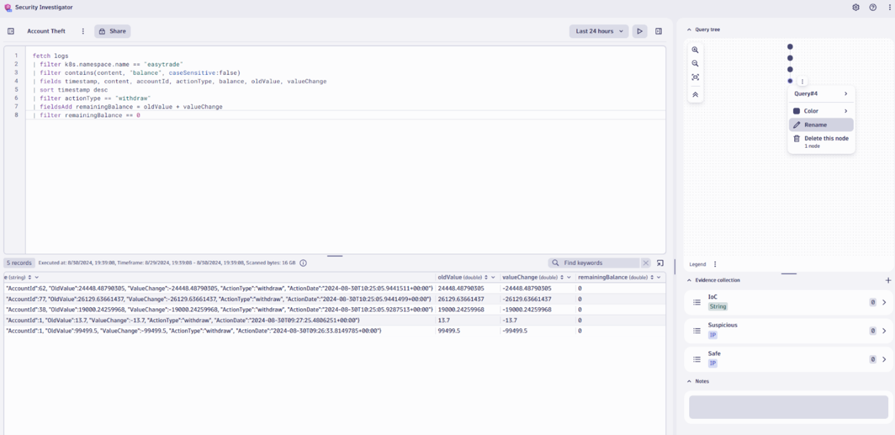
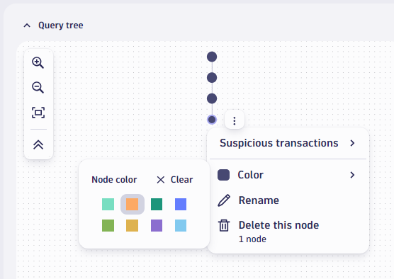
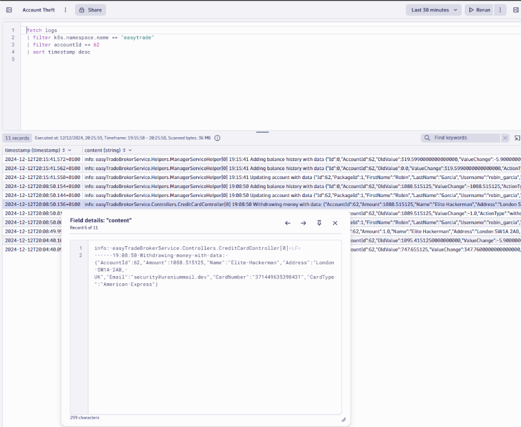
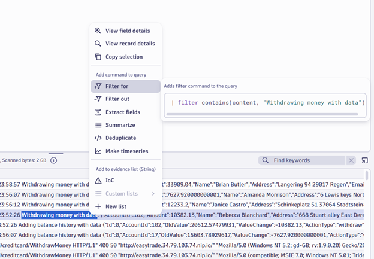
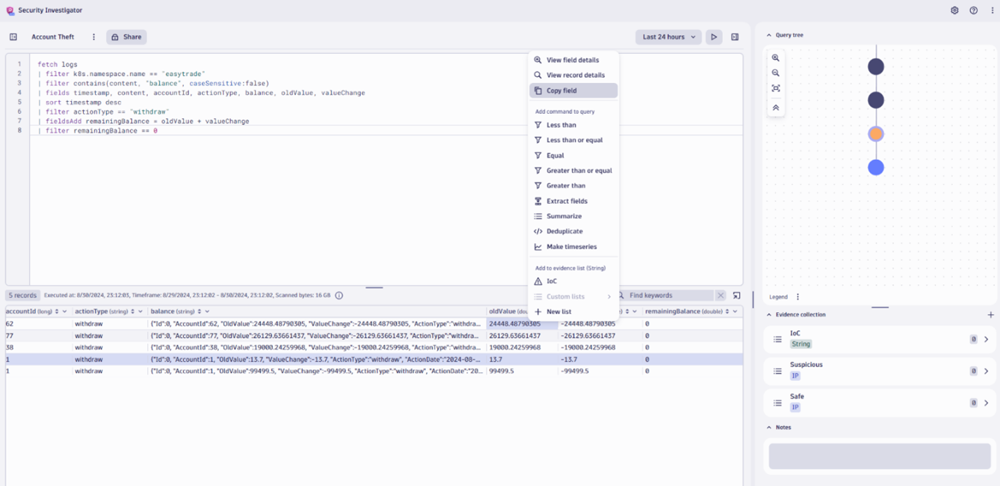
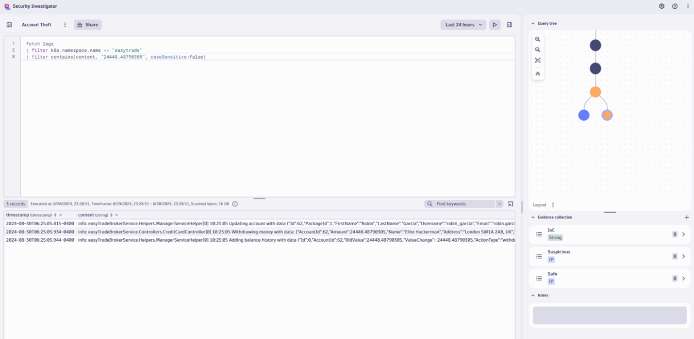
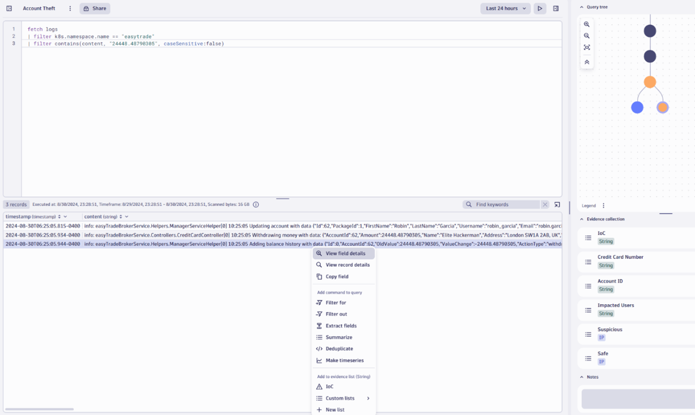

## Lab4: Security Use Case
 
### Preparation/Context 
 
1.	In your Dynatrace environment, navigate to the **Workflows app**. 
2.	Open and run the **Get Rich workflow**. 
 
This workflow empties the *EasyTrade* accounts for a few select customers.   

In this lab exercise, we will analyze logs by using the *Security Investigator* app to identify which user accounts are impacted, who emptied the accounts, and where the money went. 

1.	To start this exercise, we will use a new app called the **Security Investigator**. As we did before, simply use the search function to find and open this app  


2.	Once you have opened the app, create a new case and rename it **Account Theft**  


3.	We will be reusing the same query from the previous lab exercise as a starting point for our investigation. Replace the existing DQL query with **the following query**: 

```DQL
fetch logs 
| filter k8s.namespace.name == "easytrade" 
| filter contains(content, "balance", caseSensitive:false) 
| fields timestamp, content, accountId, actionType, balance, oldValue, valueChange 
| sort timestamp desc
```

4.	Click the **Play button** to run the query. 
  


This provides us with relevant log records in the selected timeframe. These results (thanks to the fields portion of the command) limit the resulting fields shown to those we are interested in. 
 
Notice that after running our query, the query tree now includes a *node – Query#1*. We will further explore how to manage these later. 

Additionally, note the evidence collection section. This allows us to track interesting data as we come across it during our investigation. We will make use of this later as well. 

5.	Since we know that money has been taken out of accounts, we want to investigate log records related to *withdrawal transactions*. Look through records for one with the actionType value **withdraw**. Right click on the field and select “**Filter for**” and run the query.
 


This will filter out the data for all the withdrawals. Notice the addition of the last filter command and the second node in the query tree. 

6.	We’ve been notified that several accounts have been emptied – this is where we want to focus our attention. Let’s identify accounts that fit this criterion. *How can this be achieved with the information available?*

Each record has values for *oldValue* and *valueChange* 

We can calculate the remaining balance for each transaction by adding the following command to the end of our query: 

```DQL
| fieldsAdd remainingBalance = oldValue + valueChange 
```

7.	Re-run **the query**. When looking at the results, we see entries with a *remainingBalance of 0* – let’s filter on these by right-clicking the cell and selecting **Equal** 


8.	Re-run **the query**. We now see suspicious transactions matching the criteria given before. Let’s keep track of this by renaming the corresponding node in the query tree to **Suspicious transactions**. Right-click the node and select **Rename** 
 


We can additionally change the color of the node to highlight it as an important part or finding in our investigation process: 



9.	We must do further investigation to understand who withdrew the money or where it went for each of these suspicious transactions. There are several ways to approach this.  
 
An easy way is by searching log records with text filters. Let’s modify our query to look at all log records that contain “**withdraw**” using the following query: 

```DQL
fetch logs 
| filter k8s.namespace.name == "easytrade"
| filter k8s.deployment.name == "brokerservice-*" 
| filter contains(content, "withdraw", caseSensitive:false) 
```



Run the query. The results show records relating to money withdrawals. Right-click **a record** and select **View field details** to expand the content field. 
 

The resulting modal shows us several pieces of information that are of interest: 
- *AccountId*
- *Amount*
- *CardNumber* 
- *Email*

With this information, there are a few possibilities to further investigate the suspicious transactions identified previously—either by *account ID* or the *amount withdrawn*.

10.	To keep the query tree clean (so we or others can understand our steps), rename the corresponding node for this query to **Identify withdrawal information**. Additionally, changing **the color** of the node can be useful (visually) to show that this query is not directly tied to the specific transactions we want to investigate, but it is still a step in the right direction.
 


11.	Note that we could instead further refine our query to only show us records containing “**Withdrawing money with data**” instead of broadly searching for all records containing “**withdraw**”. Highlight the string in one of the log records, right-click, and select **Filter for**. Re-run **the query** to update the results. 
 


12.	Click on the previous node – **Suspicious transactions** – to grab the specific *account ID* or amount for our first suspicious transaction. In our case, we will copy the first **oldValue amount**. 
 


13.	 Modify the query to filter for records that contain the **amount value copied**. DQL query example based on the screenshot/data above: 

```DQL
fetch logs 
| filter k8s.namespace.name == "easytrade" 
| filter contains(content, "24448.48790305", caseSensitive:false) 
```



After running the query, notice that an additional node of the same color is added to the previously selected node. The resulting log records provide us with important details that explain what happened, including: 
- When the balance history was updated 
- Who withdrew the money 
- Who the impacted account belongs to 
 
Time to extract these pieces of valuable information!  

14.	Create new evidence collections to store our findings. We will create 3 collections: 
    - Credit Card Number 
    - Account ID 
    - Impacted Users 

To create a new evidence collection, click the **+ button**. Add the corresponding title. Ensure the evidence type is String, then click **Confirm**. 


With evidence collections created, we can now extract these values for the first suspicious transaction by looking at the results we generated previously. (step 13) 

15.	Right-click the bottom log record containing “**Adding balance history with data**”, then select **View field details** 
  


- Add the **AccountId** value to the Account ID evidence collection: 
- Highlight the **account ID value**
- Right-click and hover over **Custom lists** 
- Select **Account ID** 
 


16.	Click the **left arrow** in the modal to view the **previous log record**. 
    - Add the **CardNumber value** to the **Credit Card Number** evidence collection: 
    - Highlight the **CardNumber value** 
    - Right-click and hover over **Custom lists** 
    - Select **Credit Card Number** 


  
17.	Click the **left arrow** in the modal again to view the **previous log record**. 
    - Add the **email address** of the user affected to the **Impacted Users** evidence collection: 
    - Highlight the **Email value** 
    - Right-click and hover over **Custom lists** 
    - Select **Impacted Users** 


  
All values should now be seen in the Evidence collection section: 


 
Repeat **steps 14 – 17** for the remaining *suspicious transactions*. You will end up with evidence collections containing all *affected account IDs, emails of user accounts affected, and credit card numbers* (to explain where the withdrawn money went). 
 
**This completes our investigation!** We can contact the affected users to notify them of the suspicious activity and our findings. 